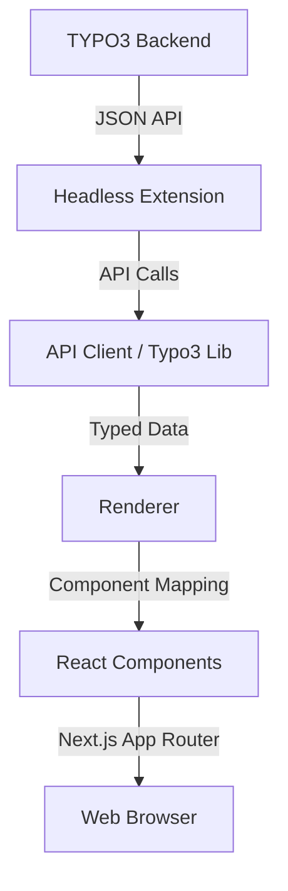

# TYPO3 Headless Next.js Frontend


[](https://github.com/CasianBlanaru/Next.js-Front-End-for-TYPO3-Headless/actions/workflows/ci.yml)


The most professional, production-ready, open-source Next.js frontend for **TYPO3 Headless**. Built with modern best practices for React 19, TypeScript, and the TYPO3 ecosystem.

---

## 🚀 Features

- **TYPO3 Headless Integration**: Seamlessly renders content from the [TYPO3 Headless extension](https://github.com/friendsoftypo3/headless).
- **Dynamic Routing**: Automatic slug resolution for TYPO3 pages.
- **Frontend Editing**: Real-time content editing support directly in the frontend.
- **Advanced Search**: Integrated search functionality with faceting and KI support.
- **SEO Optimized**: Dynamic metadata, OpenGraph, Twitter cards, and sitemap generation.
- **Image Optimization**: Automatic image processing via TYPO3 and Next.js Image.
- **GSAP Animations**: Smooth, high-performance animations for content elements.
- **TypeScript**: 100% type-safe codebase with strict mode enabled.
- **Enterprise Testing**: Robust testing suite with Vitest and Playwright.

---

## 🏗️ Architecture

The project follows a modular architecture that separates the API communication, content rendering, and UI components.



### Core Components

1.  **API Client (`src/lib/typo3.ts`)**: Handles all communication with the TYPO3 Headless API, including caching and authentication.
2.  **Renderer (`src/components/Renderer.tsx`)**: Maps TYPO3 content elements (CTypes) to React components.
3.  **App Router**: Utilizes Next.js 15+ features for server-side rendering and metadata management.

---

## 📦 Relationship with `@pixelcoda/headless-nextjs`

This repository serves as a **reference implementation** and starter template that utilizes the core logic provided by the `@pixelcoda/headless-nextjs` package.

-   **`@pixelcoda/headless-nextjs`**: Contains shared logic, base components (like `T3Frame`), and developer tools. It is designed to be version-independent and reusable across multiple TYPO3 projects.
-   **This Repository**: Provides the project-specific configuration, layout, styling, and custom component implementations. It is the "glue" that brings the package features into a concrete website.

---

## 🛠️ Getting Started

### Prerequisites

-   Node.js 22.0.0 or higher
-   A running TYPO3 instance with `ext:headless` and `ext:headless_typo3` installed.

### Installation

```bash
# Clone the repository
git clone https://github.com/CasianBlanaru/Next.js-Front-End-for-TYPO3-Headless.git
cd Next.js-Front-End-for-TYPO3-Headless

# Install dependencies
npm install
```

### Configuration

Copy `.env.example` to `.env.local` and update the values:

```env
NEXT_PUBLIC_TYPO3_BASE_URL=https://your-typo3-instance.com
NEXT_PUBLIC_BASE_URL=http://localhost:3000
```

### Development

```bash
npm run dev
```

---

## 🧪 Testing

We take quality seriously. The project includes unit, component, and E2E tests.

```bash
# Run unit tests
npm test

# Run type check
npm run typecheck

# Run E2E tests
npx playwright test
```

---

## 🚢 Deployment

### Vercel / Railway / Docker

The project is optimized for modern cloud platforms and includes a `Dockerfile` for containerized environments.

```bash
docker build -t typo3-nextjs-frontend .
```

---

## 🗺️ Roadmap

- [ ] Support for TYPO3 14 LTS
- [ ] Advanced form rendering with `ext:form`
- [ ] Multi-language switcher component
- [ ] Improved documentation for custom CTypes
- [ ] Lighthouse Performance > 98 target

---

## 📄 License

This project is licensed under the MIT License - see the [LICENSE](LICENSE) file for details.

Developed with ❤️ by [PixelCoda](https://pixelcoda.com).
